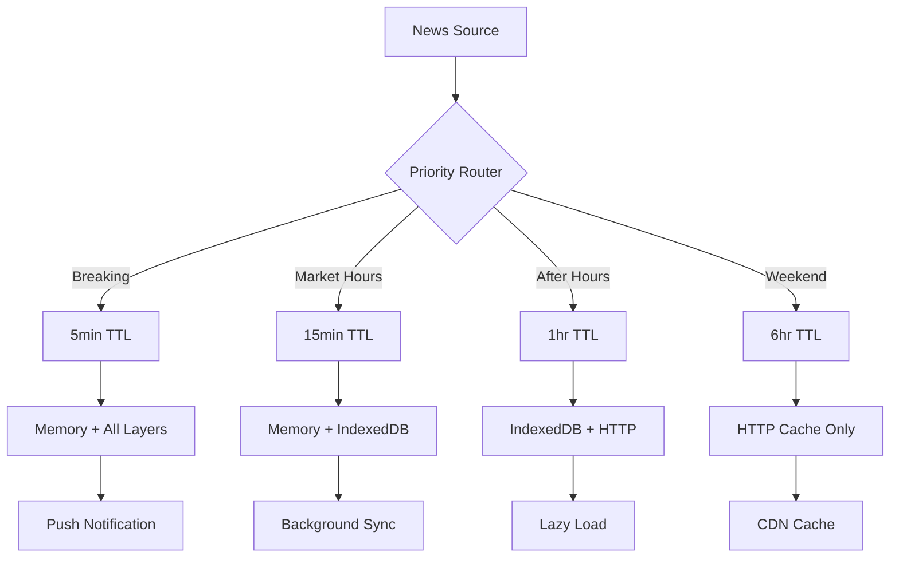

# Naly Cache Implementation Roadmap & Strategic Analysis

## Executive Deep Dive

### Critical Success Factors for Financial News Caching

1. **Time Sensitivity**: Financial news loses value exponentially - breaking news about Fed decisions or earnings can move markets in seconds
2. **Data Integrity**: Cached financial data must never show stale prices or outdated market-moving information
3. **Personalization**: Users track specific tickers/portfolios - cache must be user-aware
4. **Compliance**: Financial data caching must consider redistribution rights and data vendor agreements
5. **Real-time Sync**: Multi-device users expect instant sync of read/bookmarked articles

## Architecture Philosophy

### Why Hybrid Over Single-Layer

**Traditional Approach Problems:**
- Browser cache: No programmatic control, cleared randomly
- localStorage: 5MB limit, synchronous, blocks main thread
- IndexedDB only: Async overhead for every read
- Server cache only: Network latency on every request

**Hybrid Approach Benefits:**
- Memory cache: <1ms access for hot data
- localStorage: Synchronous fallback for critical settings
- IndexedDB: Unlimited storage for article content
- HTTP cache: Bandwidth savings with ETags
- Service Worker: True offline capability

### Financial News Specific Considerations



## Implementation Roadmap

### Phase 0: Pre-Implementation (Week 0)

#### Technical Debt Assessment
```typescript
// Audit current implementation for:
interface TechnicalDebtAudit {
  // Performance bottlenecks
  slowQueries: string[]           // Queries taking >500ms
  unnecessaryFetches: string[]    // Duplicate API calls
  memoryLeaks: string[]          // Unsubscribed intervals/listeners

  // Data consistency issues
  staleDataRisks: string[]       // Places showing outdated info
  raceconditions: string[]       // Concurrent update conflicts

  // Infrastructure gaps
  missingIndexes: string[]       // Database indexes needed
  unoptimizedAssets: string[]   // Large uncompressed files
}
```

#### Stakeholder Alignment
- Product: Define "acceptable staleness" for each content type
- Legal: Review data caching compliance requirements
- Infrastructure: Plan for increased client-side storage
- UX: Design offline indicators and stale data warnings

### Phase 1: Foundation Layer (Days 1-5)

#### Day 1-2: Core Cache Infrastructure
```typescript
// Priority 1: Cache configuration with market hours awareness
interface MarketAwareCacheConfig {
  getTTL(contentType: string): number {
    const now = new Date()
    const hour = now.getHours()
    const day = now.getDay()
    const isMarketHours = day >= 1 && day <= 5 && hour >= 9 && hour <= 16

    const baseTTL = {
      'breaking': 5 * 60 * 1000,
      'earnings': 15 * 60 * 1000,
      'analysis': 60 * 60 * 1000,
      'education': 24 * 60 * 60 * 1000
    }[contentType]

    // Shorter TTL during market hours
    return isMarketHours ? baseTTL / 2 : baseTTL
  }
}
```

#### Day 3-4: SWR Integration
```typescript
// Priority 2: SWR provider with financial data optimization
class FinancialSWRProvider {
  // Separate caches for different data types
  private caches = {
    quotes: new Map(),      // 1-minute TTL
    news: new Map(),        // 5-minute TTL
    analysis: new Map(),    // 1-hour TTL
    historical: new Map()   // 24-hour TTL
  }

  // Smart serialization for financial data
  private serializeKey(key: string, params: any): string {
    if (key.includes('/quotes/')) {
      // Include timestamp for quote data
      return `${key}:${Math.floor(Date.now() / 60000)}`
    }
    return super.serializeKey(key, params)
  }
}
```

#### Day 5: IndexedDB Schema
```typescript
// Priority 3: Optimized schema for financial articles
interface OptimizedSchema {
  articles: {
    // Composite indexes for common queries
    indexes: [
      '[userId+category+publishedAt]',  // User's category feed
      '[tickers+publishedAt]',          // Ticker-specific news
      '[sentiment+marketImpact]',       // AI analysis queries
      'searchText'                      // Full-text search
    ],

    // Automatic cleanup
    hooks: {
      creating: 'addSearchText',
      deleting: 'cleanupRelated'
    }
  }
}
```

### Phase 2: Intelligence Layer (Days 6-10)

#### Day 6-7: Predictive Prefetching
```typescript
class PredictivePrefetcher {
  // Learn user patterns
  private userPatterns = {
    readingTimes: [],      // When user reads news
    preferredCategories: [], // Most viewed categories
    tickerInterests: [],   // Frequently viewed tickers
    readingDepth: 0        // Avg articles per session
  }

  async prefetchForUser(userId: string) {
    const predictions = await this.predictNextReads(userId)

    // Prefetch top 5 predicted articles
    for (const prediction of predictions.slice(0, 5)) {
      // Low priority background fetch
      requestIdleCallback(() => {
        this.silentPrefetch(prediction.url)
      })
    }
  }

  private predictNextReads(userId: string) {
    // ML model or heuristics based on:
    // - Time of day patterns
    // - Category preferences
    // - Related tickers to portfolio
    // - Trending topics
    // - Unread important news
  }
}
```

#### Day 8-9: Smart Cache Eviction
```typescript
class SmartCacheEvictor {
  // Score-based eviction
  private calculateEvictionScore(item: CachedArticle): number {
    const age = Date.now() - item.cachedAt
    const accessRecency = Date.now() - item.accessedAt
    const importance = this.getImportanceScore(item)

    // Lower score = more likely to evict
    return (
      (item.accessCount * 1000) +           // Popularity
      (importance * 500) -                  // Importance
      (age / 1000) -                        // Age penalty
      (accessRecency / 500) -              // Recency penalty
      (item.size / 10000)                  // Size penalty
    )
  }

  private getImportanceScore(item: CachedArticle): number {
    let score = 0

    if (item.marketImpact === 'high') score += 10
    if (item.category === 'breaking') score += 8
    if (item.bookmarked) score += 7
    if (item.tickers?.includes(userPortfolio)) score += 5
    if (item.sentiment !== 'neutral') score += 3

    return score
  }
}
```

#### Day 10: Cross-Device Sync
```typescript
class CrossDeviceSync {
  private syncChannel: BroadcastChannel
  private wsConnection: WebSocket

  constructor() {
    // Local sync between tabs
    this.syncChannel = new BroadcastChannel('naly_sync')

    // Remote sync between devices
    this.wsConnection = new WebSocket('wss://sync.naly.com')

    this.setupSyncHandlers()
  }

  private setupSyncHandlers() {
    // Sync read states
    this.syncChannel.onmessage = (e) => {
      if (e.data.type === 'article_read') {
        this.markLocalAsRead(e.data.articleId)
        this.syncToServer(e.data)
      }
    }

    // Server sync
    this.wsConnection.onmessage = (e) => {
      const update = JSON.parse(e.data)
      this.applyServerUpdate(update)
    }
  }
}
```

### Phase 3: Performance Layer (Days 11-15)

#### Day 11-12: Response Streaming
```typescript
class StreamingNewsLoader {
  async *streamArticles(category: string) {
    // Stream from cache first
    const cached = await this.getCachedArticles(category)
    for (const article of cached) {
      yield { article, source: 'cache' }
    }

    // Then stream fresh data
    const response = await fetch(`/api/news/${category}`, {
      headers: { 'Accept': 'application/x-ndjson' }
    })

    const reader = response.body?.getReader()
    const decoder = new TextDecoder()

    while (reader) {
      const { done, value } = await reader.read()
      if (done) break

      const lines = decoder.decode(value).split('\n')
      for (const line of lines) {
        if (line) {
          const article = JSON.parse(line)
          yield { article, source: 'network' }

          // Cache as we stream
          this.cacheArticle(article)
        }
      }
    }
  }
}
```

#### Day 13-14: WebAssembly Compression
```typescript
// Using WASM for efficient compression
class WasmCompression {
  private wasmModule: WebAssembly.Module

  async initialize() {
    const wasmBuffer = await fetch('/compression.wasm')
      .then(r => r.arrayBuffer())

    this.wasmModule = await WebAssembly.compile(wasmBuffer)
  }

  compress(data: Uint8Array): Uint8Array {
    // Use Brotli/Zstd via WASM for better compression
    // 60-70% size reduction for JSON
    return this.wasmCompress(data)
  }
}
```

#### Day 15: Performance Monitoring
```typescript
class PerformanceMonitor {
  private metrics = {
    cacheHits: 0,
    cacheMisses: 0,
    avgLoadTime: 0,
    p95LoadTime: 0,
    offlineServed: 0
  }

  reportVitals() {
    // Web Vitals integration
    new PerformanceObserver((list) => {
      for (const entry of list.getEntries()) {
        if (entry.entryType === 'largest-contentful-paint') {
          this.metrics.lcp = entry.startTime
        }
      }
    }).observe({ entryTypes: ['largest-contentful-paint'] })

    // Custom metrics
    this.trackCachePerformance()
    this.trackDataFreshness()
    this.trackUserExperience()
  }
}
```

### Phase 4: Advanced Features (Days 16-20)

#### Day 16-17: AI-Powered Cache
```typescript
class AICacheOptimizer {
  // Use AI to optimize cache decisions
  async optimizeCacheStrategy(userProfile: UserProfile) {
    const features = {
      readingFrequency: userProfile.avgDailyReads,
      preferredTopics: userProfile.topCategories,
      deviceStorage: await navigator.storage.estimate(),
      networkSpeed: navigator.connection?.effectiveType,
      timeZone: Intl.DateTimeFormat().resolvedOptions().timeZone
    }

    // Call AI model
    const strategy = await this.callAIModel(features)

    return {
      prefetchCount: strategy.prefetchCount,
      ttlMultiplier: strategy.ttlMultiplier,
      compressionLevel: strategy.compressionLevel,
      syncFrequency: strategy.syncFrequency
    }
  }
}
```

#### Day 18-19: Differential Sync
```typescript
class DifferentialSync {
  // Only sync changes, not full articles
  async syncChanges(lastSyncTime: number) {
    const changes = await fetch(`/api/sync/diff?since=${lastSyncTime}`)
    const diff = await changes.json()

    // Apply patches to local cache
    for (const patch of diff.patches) {
      await this.applyPatch(patch)
    }

    // Efficient sync with minimal data transfer
    return diff.newSyncTime
  }

  private async applyPatch(patch: any) {
    switch (patch.op) {
      case 'add':
        await articleDb.articles.add(patch.value)
        break
      case 'update':
        await articleDb.articles.update(patch.id, patch.value)
        break
      case 'delete':
        await articleDb.articles.delete(patch.id)
        break
    }
  }
}
```

#### Day 20: Edge Computing Integration
```typescript
class EdgeCacheManager {
  // Utilize Cloudflare Workers for edge caching
  async setupEdgeCache() {
    // Deploy worker script
    const workerScript = `
      addEventListener('fetch', event => {
        event.respondWith(handleRequest(event.request))
      })

      async function handleRequest(request) {
        const cache = caches.default
        let response = await cache.match(request)

        if (!response) {
          response = await fetch(request)

          // Cache at edge based on headers
          if (response.headers.get('Cache-Control')) {
            event.waitUntil(cache.put(request, response.clone()))
          }
        }

        // Add cache status header
        response.headers.set('CF-Cache-Status', 'HIT')
        return response
      }
    `

    // Edge cache with geolocation awareness
    return this.deployToEdge(workerScript)
  }
}
```

## Risk Mitigation Strategies

### Technical Risks

1. **Storage Quota Exceeded**
   - Mitigation: Progressive cleanup algorithm
   - Fallback: Use quota API to pre-check
   - Recovery: Prompt user to clear old data

2. **Cache Corruption**
   - Mitigation: Checksums on critical data
   - Fallback: Version-based cache invalidation
   - Recovery: Automatic rebuild from server

3. **Performance Degradation**
   - Mitigation: Circuit breakers on cache operations
   - Fallback: Direct API access if cache slow
   - Recovery: Background cache rebuild

### Business Risks

1. **Stale Financial Data**
   - Mitigation: Visual indicators for data age
   - Fallback: Force refresh on critical pages
   - Recovery: Automatic refresh on market open

2. **Compliance Violations**
   - Mitigation: Data classification system
   - Fallback: Exclude sensitive data from cache
   - Recovery: Audit trail of cached data

## Success Metrics & KPIs

### Technical Metrics
```typescript
interface CacheKPIs {
  // Performance
  avgLoadTime: number        // Target: <500ms
  p95LoadTime: number        // Target: <2s
  cacheHitRate: number       // Target: >80%

  // Efficiency
  bandwidthSaved: number     // Target: >60%
  apiCallsReduced: number    // Target: >70%
  storageEfficiency: number  // Target: <100MB avg

  // Reliability
  offlineAvailability: number // Target: 100%
  syncSuccessRate: number     // Target: >99%
  dataFreshness: number       // Target: <5min for breaking
}
```

### Business Metrics
```typescript
interface BusinessKPIs {
  // User Experience
  userEngagement: number      // Target: +25%
  sessionDuration: number     // Target: +30%
  articleReadsPerSession: number // Target: +40%

  // Performance
  bounceRate: number         // Target: -20%
  pageViewsPerUser: number   // Target: +35%
  returnUserRate: number     // Target: +15%

  // Infrastructure
  serverCosts: number        // Target: -30%
  cdnCosts: number          // Target: -40%
  apiCosts: number          // Target: -50%
}
```

## Rollout Strategy

### Week 1: Internal Testing
- Deploy to staging environment
- Internal team testing (10 users)
- Performance baseline measurement
- Bug fixes and optimizations

### Week 2: Beta Rollout
- 5% of production traffic
- A/B testing cache vs no-cache
- Monitor all metrics closely
- Gather user feedback

### Week 3: Gradual Expansion
- 25% → 50% → 75% traffic
- Performance optimization based on data
- Address edge cases
- Fine-tune cache parameters

### Week 4: Full Rollout
- 100% traffic with feature flags
- Continuous monitoring
- Documentation and training
- Post-implementation review

## Long-term Vision

### 6 Months: ML-Driven Optimization
- User behavior prediction models
- Automatic cache tuning
- Personalized prefetching
- Anomaly detection

### 12 Months: Edge-First Architecture
- Global edge cache network
- Regional data centers
- P2P cache sharing
- Blockchain-verified data integrity

### 18 Months: Quantum-Ready
- Post-quantum cryptography
- Quantum-resistant compression
- Distributed ledger cache
- Zero-knowledge proof freshness

## Conclusion

This hybrid cache implementation will transform Naly from a traditional client-server architecture to a modern edge-first, offline-capable progressive web app. The phased approach minimizes risk while delivering immediate value through improved performance and user experience.

Key success factors:
1. **Start simple**: Basic caching delivers 80% of value
2. **Measure everything**: Data-driven optimization
3. **User-first**: Prioritize UX over technical elegance
4. **Iterate rapidly**: Ship weekly, learn daily
5. **Plan for scale**: Build for 10x current load

The investment in caching infrastructure will pay dividends through reduced infrastructure costs, improved user engagement, and competitive advantage in the real-time financial news space.